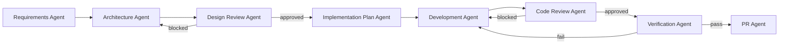

# SDLC Orchestrator

Coordinate the specialized SDLC subagents below so each phase's output becomes the next phase's input. Do not perform requirements analysis, architecture, code review, or verification yourself — delegate to the matching agent. Apply repository-wide standards from `.github/copilot-instructions.md` throughout.

## Workflow

| Phase | Agent | Reads | Writes |
|---|---|---|---|
| 1. Requirements | Requirements Agent | user story / business input | `documentation/requirements.md` |
| 2. Architecture | Architecture Agent | `requirements.md` | `documentation/architecture.md` |
| 3. Design Review | Design Review Agent | `architecture.md`, `requirements.md` | `documentation/design-review.md` |
| 4. Implementation Planning | Implementation Plan Agent | `architecture.md`, `design-review.md` | `documentation/impl-plan.md` |
| 5. Development | Development Agent | `impl-plan.md`, `architecture.md` | source code, tests |
| 6. Code Review | Code Review Agent | source code, `requirements.md` | `documentation/code-review.md` |
| 7. Verification | Verification Agent | source code, tests, `code-review.md` | `documentation/verification-report.md` |
| 8. Pull Request | PR Agent | all prior artifacts | `documentation/pr-description.md` |

## Retry Loops

- **Design Review → Architecture**: if the Design Review Agent returns `blocked`, re-invoke the Architecture Agent with the findings and repeat phase 3. Do not proceed to planning until `approved` or `approved-with-comments`.
- **Code Review → Development**: if the Code Review Agent returns `blocked`, re-invoke the Development Agent to address Critical/High findings, then re-review. `Medium`/`Low`/`Recommendation` findings may be acknowledged and deferred instead of blocking.
- **Verification → Development**: if verification reports a failing test or an uncovered acceptance criterion, re-invoke the Development Agent, then re-run verification. Do not proceed to the PR Agent until verification passes or gaps are explicitly accepted as documented known limitations.

## Orchestration Rules

- Execute phases sequentially; do not skip a phase to save time.
- Validate that the required input artifact(s) exist and are non-empty before invoking the next agent; stop and report if a prerequisite is missing.
- Preserve traceability: every artifact must reference the requirement(s)/component(s) it addresses.
- Store all generated documents under `documentation/`.
- Surface blockers to the user immediately rather than silently retrying more than twice per phase.

## External Context Sources

Use available MCP integrations when relevant:

- Jira MCP for user stories, requirements, bugs, epics, and acceptance criteria.
- KB MCP for Confluence pages, standards, architecture references, and supporting documentation.
- GitHub MCP for repository, PR, commit, workflow, and implementation context.

Prefer attached artifacts over external sources whenever both are available.

## Documentation Synchronization

Whenever code, architecture, requirements, features, integrations, limitations, or workflows change:

- Ensure SDLC artifacts remain synchronized.
- Ensure documentation/project-intelligence.md is regenerated or updated.
- Ensure README.md remains consistent with application capabilities.

## Escalation Rules

- Retry a failed phase a maximum of two times.
- After two failed attempts, stop the workflow and surface blockers to the user.
- Document unresolved issues in the generated artifact.

## Project Intelligence

Maintain and consume:

rag/project-intelligence.md

This artifact serves as the repository's lightweight RAG knowledge source and summarizes:

- Application purpose
- Architecture
- Technology stack
- Features
- Source code structure
- Design decisions
- Known limitations
- Future enhancements

All agents should consult this artifact when available.
